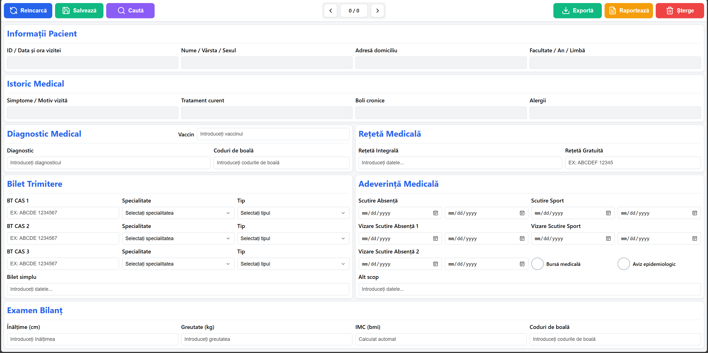

# UMF Patient Management System – Google Apps Script Web App

This project is a medical registry system used for managing student medical records at **UMF Cluj**.  
It uses a **Google Apps Script backend** connected to a lightweight **HTML/CSS/JS frontend**, all running inside the Google Workspace ecosystem.

---

## 📸 Screenshot

### Web App Interface Preview

Below is the main UI — a simple, fast, panel-based layout for searching, viewing, editing, and exporting patient data:

---

## ⚙️ Features

### Backend (Google Apps Script)
- Full spreadsheet-based patient registry
- Auto-generated IDs & timestamps for new submissions
- Safe date parsing and formatting (ISO ⇆ RO)
- BT-CAS fields processing and parsing
- Date-range processing for medical certificates
- Daily patient filtering (loads only today's patients)
- Optimized name search (multi-word, case-insensitive, reverse scan)
- Fast export to a formatted spreadsheet
- Detailed statistics and report generation
- Strict access control based on allowed emails
- Automatic cleanup and formatting for Google Form submissions

### Frontend (HTML/CSS/JS)
- Instant live search for students
- View and edit full patient records
- Manage BT-CAS entries, diagnostics, certificates, and codes
- Export data for specific date intervals
- Responsive, minimal, and fast interface
- Communicates with backend via `google.script.run`

---

## 🛠 Backend Core Functions & Optimizations

The backend was carefully optimized for **speed, accuracy, and usability**, focusing on Google Sheets efficiency:

### 1. Efficient Patient Loading
- `loadPatientData()` loads only **today’s patients**, avoiding scanning the entire sheet.
- Reverse scanning ensures the **most recent entries are processed first**, reducing unnecessary iterations.

### 2. Optimized Search
- `searchPatientData()` uses **multi-word, case-insensitive matching**.
- Reverse iteration prioritizes **recent records**.
- Row data is cached in a **Map** to avoid repeated sheet reads, minimizing Google Sheets API calls.

### 3. Date Filtering
- `findFirstRowByDateTime()` and `findLastRowByDateTime()` implement **binary search** on timestamps for **fast range queries**.
- Handles missing or malformed date cells gracefully to prevent runtime errors.

### 4. BT-CAS & Medical Certificates
- `processBtCasForSave()` serializes BT-CAS entries into a single field efficiently.
- `parseBtCasForDisplay()` splits stored BT-CAS data for UI display without extra database queries.
- `processDateRangeForSave()` and `parseDateRangeForDisplay()` convert between RO/ISO formats and compress date ranges into minimal storage strings.

### 5. Export & Reporting
- `exportPatientData()` batches updates to reduce Google Sheets API calls.
- Column widths, font sizes, and formatting are applied programmatically for **professional exports**.
- `reportPatientData()` precomputes **all statistics in memory** using `Int32Array` for fast counting of codes and prescriptions.
- Generates a **ready-to-send HTML report** that is emailed automatically.

### 6. Safety & Authorization
- All critical functions (`savePatientData`, `deletePatientData`, `loadPatientData`, `reportPatientData`) check email authorization before performing any action.
- Auto-validation ensures **IDs, dates, and required fields** are correctly formatted before saving.

### 7. Performance Optimizations
- **Batch operations** for writes instead of per-cell updates.
- **Reverse loops** to prioritize recent entries.
- **In-memory counting** for statistics and codes.
- Conditional checks skip unnecessary computations for empty or invalid rows.

---

## 🔗 Live Demo & Links

- **Live Web App:** [UMF Patient Management System](https://script.google.com/macros/s/AKfycbzrHNsvOp8TcDMPFfcob9Lm1L3IJZhGh_dtkD2fZ3kEbAxeaQJKXGTD3sGrzz9Od0cC2A/exec)  
  *Complete a form submission → refresh the website → select the entry → modify as needed.*

- **Google Form (Submit Patient Data):** [Complete Form](https://docs.google.com/forms/d/e/1FAIpQLSfdEi4e1BP_0zEhgKo1ulAoC-3FwwqycK3i7XX4d-S5RGN-pA/viewform?usp=dialog)

- **Google Sheet (Database View):** [View Spreadsheet](https://docs.google.com/spreadsheets/d/1YWRWOdLFiKcTzxGli42Pp0ldwR8ZQs5vY56GLC3POz8/edit?usp=sharing)

---
