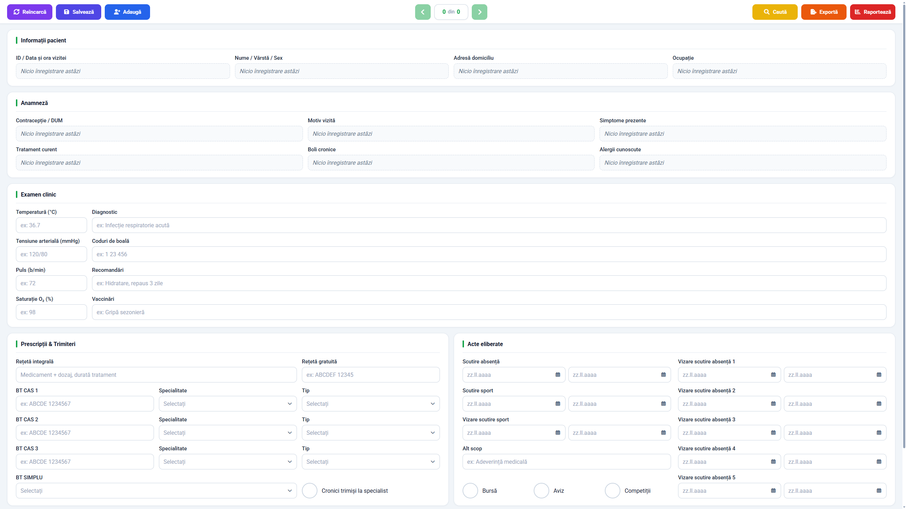
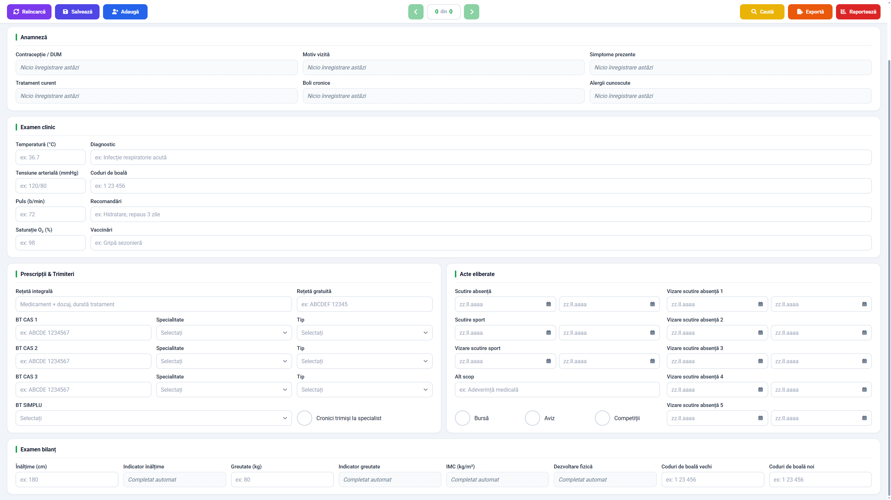

# UMF Patient Management System – Google Apps Script Web App

This project is a medical registry system used for managing patient records at the **UMF Cluj** student clinic — consultations, physical exams, prescriptions, and the medical/sport/absence certificates the clinic issues.
It uses a **Google Apps Script backend** connected to a lightweight **HTML/CSS/JS frontend**, all running inside the Google Workspace ecosystem.

---

## 📸 Screenshots

### Web App Interface Preview

Below is the main UI — a simple, fast, panel-based layout for searching, viewing, editing, and exporting patient data:

---

## ⚙️ Features

### Backend (Google Apps Script)
- Single spreadsheet-based patient registry (`Form Responses 1`), driven by a 65-column `CONFIG` schema covering identity, consultation exam (EC), prescriptions & tickets (RP/BT), absence & sport exemptions (AE), and the physical/bilanț exam (EB)
- `setup()` provisions the sheet on first run — column count, row count, headers, number formats per column, frozen header row and identity columns, and the required triggers
- Every write path (`addPatientData`, `editPatientData`, `savePatientData`) runs inside a script lock (`LockService`) so concurrent submissions can't corrupt a row
- Composite-key patient lookup (timestamp + name + gender + age) for editing/saving, since there's no persistent numeric ID column
- Safe date parsing across RO (`dd.MM.yyyy`), ISO (`yyyy-MM-dd`), and native `Date` values, with consistent formatting on the way back out
- `onFormSubmit()` re-normalizes incoming Google Form rows (numbers coerced to strings where needed) and repositions them into the data block
- `loadPatientData()` loads only today's patients, reverse-scanned so the most recent entries come first
- `searchPatientData()` does multi-word, case-insensitive name matching, also reverse-scanned
- `exportPatientData()` builds a dated `Export <start> - <end>` sheet in the clinic's official register format (Nr. crt., Ziua, Nume, Vârsta, Sex, Domiciliu, Ocupație, Simptome, Diagnostic, Cod, Prescripții), with column widths and formatting applied programmatically
- `reportPatientData()` tallies statistics in memory — language mix, acts performed, clinic & bilanț disease-code frequency against the official incidence/prevalence interval tables, and physical-exam indicators by gender — then emails a formatted HTML report
- `onShiftEnd()` fires on a weekday 18:00 trigger, emails a full `.xlsx` export of the sheet to the registered address, and cleans up old export sheets
- A standardized `{ success, type, message, data }` response envelope on every backend call, with Romanian-language user-facing messages throughout

### Frontend (HTML/CSS/JS)
- Instant live search for patients
- View and edit full patient records
- Manage BT-CAS entries, diagnostics, certificates, and disease codes
- Export data for specific date intervals
- Responsive, minimal, and fast interface
- Communicates with backend via `google.script.run`

---

## 🛠 Backend Core Functions & Optimizations

The backend is built around a single wide `CONFIG`-driven schema, optimized for **speed, accuracy, and usability** on top of Google Sheets:

### 1. Efficient Patient Loading
- `loadPatientData()` loads only **today's patients** by bounding the timestamp range for the current day, rather than scanning the whole sheet.
- Rows are read once in bulk and iterated **in reverse**, so the most recent entries are processed first.

### 2. Optimized Search
- `searchPatientData()` splits the query into words and requires every word to match, **case-insensitively**, against the name column.
- Reverse iteration prioritizes recent records.
- All data rows are pulled in a single bulk `getValues()` call rather than read cell-by-cell, minimizing Google Sheets API calls.

### 3. Date Range Filtering
- `rowsForExportOrReport()` resolves a start/end date into day-bounded timestamps (`dayBound()`) and filters the bulk-loaded rows against that range — shared by both export and reporting.
- `asDate()` handles missing or malformed date cells gracefully (RO format, ISO format, or native `Date`) to prevent runtime errors.

### 4. BT-CAS, Certificates & Exemptions
- BT-CAS entries, absence/sport exemptions (up to 5 endorsement pairs), and medical-scholarship/epidemiologic/competition flags are stored as plain typed columns (`applyClinicalFields()`), keeping saves simple and schema-driven.
- `exportPrescriptions()` compresses all of that — recommendations, vaccinations, prescriptions, BT-CAS tickets, exemption date ranges, physical-exam metrics, disease codes — into a single compact text block only at export time.

### 5. Export & Reporting
- `exportPatientData()` batches the whole write instead of per-cell updates.
- Column widths, fonts, and formatting are applied programmatically for a **professional export** matching the official clinic register layout.
- `reportPatientData()` precomputes **all statistics in memory** using `Uint16Array` counters for fast per-code tallying across up to 1,000 disease codes.
- Disease-code frequency is rolled up against two official interval tables — `CLINIC_CODE_INTERVALS` (incidence) and `PREVALENCE_CODE_INTERVALS` (morbidity/prevalence, ~59 categories) — and physical-exam results are broken down by gender and body-index level.
- Generates a **ready-to-send HTML report** (`buildReportHtml()`) that is emailed automatically.

### 6. Concurrency Safety
- `withLock()` wraps every write-returning function (`addPatientData`, `editPatientData`, `savePatientData`, `onFormSubmit`) in a script lock, so two near-simultaneous submissions can't overwrite each other.
- Consistent `ok()` / `info()` / `fail()` response helpers ensure the frontend always gets a predictable `{ success, type, message, data }` shape, even on error.

### 7. Performance Optimizations
- **Batch operations** for writes instead of per-cell updates.
- **Reverse loops** to prioritize recent entries.
- **In-memory counting** with typed arrays for statistics and disease codes.
- One bulk read per operation instead of per-row sheet reads.

---